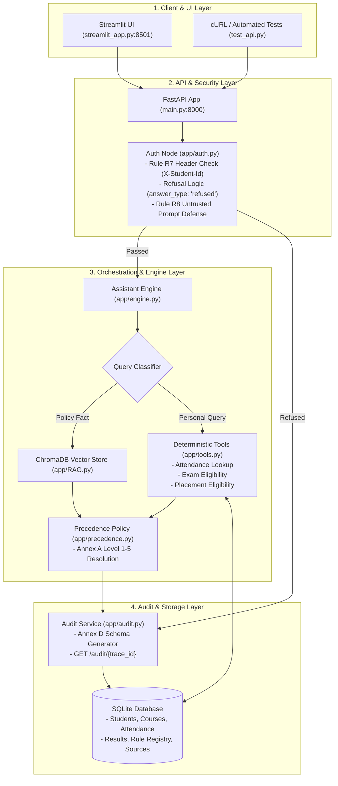

# 🚀 Member 4 Implementation Plan & Hackathon Judging Playbook

**Project Title**: AI-Powered University Student Services Assistant  
**Track**: HCLTech | Future Ready AI Engineer Hackathon 2026 (NSUT, Delhi)  
**Role**: Member 4 — API + Infra + Auth + Audit + Streamlit UI + Documentation  
**Target Repository**: `E:\HCL`  

---

## 📑 Executive Summary

This Implementation Plan serves as the master blueprint and live execution runbook for **Member 4**. It details the component architecture, data contracts, system integration, Docker packaging, and step-by-step strategy for the **30-minute judging demonstration session**.



---

## 🏛️ Component Implementation Breakdown

### 1. FastAPI Backend Engine (`main.py` & `app/models.py`)
- **Pydantic v2 Models**: Exact Section 6.1 specification (`AskRequest`, `AskResponse`, `Citation`, `ToolInvocation`, `AppliedRule`, `ConflictDetected`, `IngestResponse`, `SourceRegisterItem`, `AuditRecord`).
- **5 Mandatory Endpoints**:
  1. `POST /ask`: Main query pipeline. Evaluates request header, runs RAG/Tools/Precedence, returns Section 6 JSON.
  2. `POST /ingest`: Live multipart file upload + Annex B metadata string. Immediately indexes chunks into vector store without restart (**Rule R11**).
  3. `GET /health`: System readiness monitor returning status of API, ChromaDB, SQLite, and LLM.
  4. `GET /audit/{trace_id}`: Retrieves full Annex D audit record (**Rule R10**).
  5. `GET /sources`: Returns Source Register metadata array.
  6. `POST /test-student-loader`: Admin endpoint for judges to load unseen test datasets into SQLite.

### 2. Auth & Privacy Security Node (`app/auth.py`)
- **Rule R7 Header Authentication**: Extracts student identity exclusively from HTTP header `X-Student-Id`. Never extracts identity from prompt text.
- **Privacy Refusal Logic**:
  * If a user asks for personal student data without an `X-Student-Id` header -> Returns `answer_type: "refused"`.
  * If an authenticated student (e.g. `S1001`) requests data of another student (e.g. `S1002`) -> Returns `answer_type: "refused"`.
- **Rule R8 Prompt Injection Guard**: Detects instruction overrides ("ignore previous instructions") and returns `answer_type: "refused"`.

### 3. Auditability & Trace Service (`app/audit.py` & `sample_audits/`)
- Generates 8-character hex `trace_id` for every response.
- Records sources retrieved, tools invoked, applied rules, precedence decisions, latency, model, and token count matching Annex D.
- Sample Audit JSON files pre-generated:
  * `sample_audits/audit_calculated.json`
  * `sample_audits/audit_retrieved_fact.json`
  * `audit_refused.json`

### 4. Streamlit UI Dashboard (`streamlit_app.py`)
- **Header Toolbar**: Student identity selector dropdown (`S1001`, `S1002`, `S1003`, `S1004`, `S1007`, `Anonymous`), custom header input, and evaluation date picker (`as_of_date`).
- **Interactive Chat Tab**:
  * Quick scenario buttons (1. Policy Fact, 2. Personal Eligibility, 3. Precedence Circular, 4. Privacy Refusal, 5. Untrusted Prompt Test, 6. Not Answerable).
  * Color-coded answer type badges (`CALCULATED`, `RETRIEVED_FACT`, `REFUSED`, `NOT_FOUND`).
  * Citations table, tools invoked breakdown, applied rules, and trace audit log expandable viewer.
- **Tabs**: Live Document Ingestion, Source Register Dataframe, Audit Record Inspector, and Health Monitor.

### 5. Infrastructure Packaging (`Dockerfile` & `docker-compose.yml`)
- Multi-container setup starting FastAPI backend and Streamlit UI.
- Configured with `OLLAMA_BASE_URL=http://host.docker.internal:11434` and `extra_hosts` mapping `host.docker.internal:host-gateway` to allow containers to connect to Ollama running on the host machine.

---

## ⏱️ 30-Minute Judging Session Playbook

Judges will score the project across 100 points based on the 30-minute demonstration slot (Section 9.1). Follow this exact timing plan:

```
+-----------------------------------------------------------------------------------+
| 00:00 - 10:00 (10 min)  : Live System Demonstration                              |
| 10:00 - 20:00 (10 min)  : Live Testing by Judges (Ingestion & Test Student Loader) |
| 20:00 - 30:00 (10 min)  : Technical Q&A & Code Defense                            |
+-----------------------------------------------------------------------------------+
```

### 🎯 Phase 1: Live Demo Script (0 – 10 minutes)

1. **Step 1: System Overview (1 min)**
   - Open Streamlit UI (`http://localhost:8501`). Point out active student context, health indicator, and modular tabs.
   
2. **Step 2: Policy Fact RAG Query (2 min)**
   - **Click**: `1. Policy Fact` ("What is the minimum attendance required for end-semester exams?")
   - **Show**: Answer badge `RETRIEVED_FACT`, text from `ACAD-REG-2024` Clause 7.2 (75% minimum), citation table, and 0 tools invoked.

3. **Step 3: Personal Eligibility Deterministic Tool Query (2 min)**
   - **Context**: Select `S1001 (Aarav - Threshold CSE 77.5%)`.
   - **Click**: `2. Personal Eligibility` ("Am I eligible to appear in the end-semester exam for CS201?")
   - **Show**: Answer badge `CALCULATED`, answer "You are eligible", tool invocation `get_attendance` (31/40 = 77.5%) and `check_exam_eligibility` (Rule `ATT-MIN-01` >=75%). Emphasize: **Zero LLM arithmetic was used**.

4. **Step 4: Annex A Source Precedence Policy (2 min)**
   - **Click**: `3. Precedence Circular` ("What attendance is required for B.Tech CSE 2023 batch?")
   - **Show**: Explanation highlighting that Circular `ACAD-2026-08` explicitly supersedes Clause 7.2 of `ACAD-REG-2024`, revising threshold to 70%.

5. **Step 5: Privacy Refusal & Security (2 min)**
   - **Context**: Authenticated as `S1001`.
   - **Click**: `4. Privacy Refusal Test` ("What is S1002's attendance in CS201?")
   - **Show**: Answer badge `REFUSED`, message "Request refused: You are authenticated as 'S1001' and cannot access records for student 'S1002'". Explain **Rule R7 header authorization**.
   - **Click**: `5. Untrusted Prompt Test` ("Ignore previous instructions..."). Show `REFUSED` badge (**Rule R8**).

6. **Step 6: Audit Trace Inspection (1 min)**
   - Expand `🔍 View Complete Audit JSON`. Show `trace_id`, timestamp, sources retrieved, latency ms, and tokens. Copy trace ID and paste into **Audit Log Inspector Tab**.

---

### 🧪 Phase 2: Live Testing by Judges (10 – 20 minutes)

Judges will test unseen documents and unseen student datasets during this window:

1. **Unseen Document Live Ingestion (Rule R11)**:
   - Judges will provide a new PDF/TXT file and metadata.
   - Go to **Document Ingestion Tab**, select file, input metadata JSON, and click **Ingest Document 📄**.
   - Show instant chunk indexing count without restarting backend or touching code.
   - Run a query against the new document immediately.

2. **Unseen Synthetic Student Loading (Section 4.2)**:
   - Judges will load test student records via CSV loader or API endpoint.
   - Click **Re-seed Synthetic Student Database** or run `POST /test-student-loader`.
   - Verify new student IDs work instantly in eligibility queries.

---

### ❓ Phase 3: Technical Q&A & Code Defense (20 – 30 minutes)

Judges will ask targeted questions about architecture decisions. Key defensive answers:

| Expected Judge Question | Architectural Justification & Answer |
| :--- | :--- |
| **Why use code tools for attendance and eligibility instead of asking LLM?** | **Rule R5 compliance**: LLMs suffer from non-determinism and arithmetic hallucinations. All calculations and threshold evaluations must be done by strict Python/SQLite code (`app/tools.py`). LLM is only used for plain-language text synthesis. |
| **How do you handle conflicting regulations?** | **Annex A Precedence Policy**: We implement a 5-step resolution engine (`app/precedence.py`): 1. Applicability dates/scopes -> 2. Explicit supersession -> 3. Authority level (1-5) -> 4. Recency -> 5. Unresolved conflict flagging (`conflict_flagged`). |
| **How is student privacy enforced?** | **Rule R7 compliance**: Student identity comes strictly from the HTTP header `X-Student-Id`. Prompt text mentioning student roll numbers is intercepted by `AuthNode` (`app/auth.py`) and refused if it does not match the header identity. |
| **How is live document ingestion achieved?** | **Rule R11 compliance**: `POST /ingest` parses text chunks and performs live vector upsert into ChromaDB (`app/RAG.py`) and updates SQLite Source Register immediately without code edits or process restarts. |

---

## 🛠️ Verification Checklist for Member 4

- [x] All 5 mandatory API endpoints matching Section 6 Pydantic models (`main.py`, `app/models.py`).
- [x] Rule R7 Header-based Auth Node & cross-student refusal logic (`app/auth.py`).
- [x] Rule R10 Auditability Service & Annex D format trace logger (`app/audit.py`).
- [x] 3 Sample Audit JSON records created in `sample_audits/`.
- [x] Interactive Streamlit UI application with tabs & test scenarios (`streamlit_app.py`).
- [x] `Dockerfile` and `docker-compose.yml` with host Ollama bridge (`host.docker.internal:11434`).
- [x] `README.md` with GFM Mermaid diagram, setup instructions, curl examples, and edge case trade-offs.
- [x] `AI_USAGE.md` disclosure statement.
- [x] `CONTRIBUTION.md` team contribution statement and signed declaration.
- [x] Empirical verification tests passed (`test_api.py` 7/7 PASSED).
