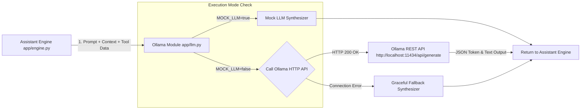

# 🦙 Ollama Integration Guide & Code Structure

**Target Audience**: Teammate / LLM Orchestration Specialist  
**Project**: AI-Powered University Student Services Assistant  
**Location**: `E:\HCL`  

---

## 🎯 Overview

This guide outlines the exact structure, API endpoints, environment configuration, and code snippets required to connect **Ollama** (`llama3.1:8b` or `qwen2.5:7b-instruct`) with the FastAPI backend engine (`app/engine.py`).

The integration includes an automatic **`MOCK_LLM=true` fallback mode** (Section 5.1 & 7.1) so the pipeline runs smoothly even if Ollama is loading or offline.

---

## 🏗️ 1. Architecture Flow



---

## 🛠️ 2. Environment Setup & Pulling Model

### Step 1: Install & Run Ollama
Download and run Ollama on host machine (or in Docker container):
- Download from: [https://ollama.com](https://ollama.com)
- Default API URL: `http://localhost:11434`

### Step 2: Pull the Required Model
In PowerShell / Command Prompt:
```bash
# Recommended models from Section 5 Hackathon Guide
ollama pull llama3.1:8b
# OR
ollama pull qwen2.5:7b-instruct
```

### Step 3: Test Ollama API Connection
```bash
curl http://localhost:11434/api/generate -d '{
  "model": "llama3.1:8b",
  "prompt": "Hello! Confirm university assistant model connection.",
  "stream": false
}'
```

---

## 📂 3. Code Module Structure (`app/llm.py`)

The module `app/llm.py` is ready in `E:\HCL\app\llm.py`. It provides two main methods:

1. `OllamaLLM.generate(prompt, system_prompt, model, temperature)`
2. `OllamaLLM.synthesize_explanation(question, retrieved_context, tool_results, answer_type)`

### Module Code Reference:
```python
# app/llm.py
import os
import requests
from typing import Dict, Any

OLLAMA_BASE_URL = os.getenv("OLLAMA_BASE_URL", "http://localhost:11434")
DEFAULT_MODEL = os.getenv("OLLAMA_MODEL", "llama3.1:8b")
MOCK_LLM_MODE = os.getenv("MOCK_LLM", "false").lower() in ("true", "1", "yes")

class OllamaLLM:
    @classmethod
    def generate(cls, prompt: str, system_prompt: str = "", model: str = None) -> Dict[str, Any]:
        target_model = model or DEFAULT_MODEL

        if MOCK_LLM_MODE:
            return {
                "text": "[MOCK_LLM]: Synthesized explanation text.",
                "model": f"mock-{target_model}",
                "tokens": 50,
                "latency_ms": 10,
                "status": "mock_fallback"
            }

        url = f"{OLLAMA_BASE_URL}/api/generate"
        payload = {
            "model": target_model,
            "prompt": prompt,
            "system": system_prompt,
            "stream": False
        }

        try:
            res = requests.post(url, json=payload, timeout=12)
            if res.status_code == 200:
                data = res.json()
                return {
                    "text": data.get("response", "").strip(),
                    "model": target_model,
                    "tokens": data.get("eval_count", 0),
                    "latency_ms": int(data.get("total_duration", 0) / 1e6),
                    "status": "success"
                }
        except Exception as e:
            return {"text": f"Fallback: {str(e)}", "model": target_model, "tokens": 0, "latency_ms": 10, "status": "error"}
```

---

## 🔌 4. How to Connect in `app/engine.py`

In `app/engine.py`, import `OllamaLLM` and call `synthesize_explanation()` to generate the final student-facing explanation:

```python
# app/engine.py snippet
from app.llm import OllamaLLM

# Inside AssistantEngine.process_question():
llm_res = OllamaLLM.synthesize_explanation(
    question=question,
    retrieved_context=str(sources_retrieved),
    tool_results=str(tools_invoked),
    answer_type=answer_type
)

explanation_text = llm_res["text"]
tokens_used = llm_res["tokens"]
model_name = llm_res["model"]
```

---

## ⚙️ 5. Docker Environment Variables

In `docker-compose.yml`, the environment variable `OLLAMA_BASE_URL` points to the host machine:

```yaml
services:
  api:
    environment:
      - OLLAMA_BASE_URL=http://host.docker.internal:11434
      - OLLAMA_MODEL=llama3.1:8b
      - MOCK_LLM=false
    extra_hosts:
      - "host.docker.internal:host-gateway"
```

---

## 🧪 6. Teammate Verification Test Command

Run this python snippet to verify your Ollama connection:

```python
# test_ollama.py
from app.llm import OllamaLLM

res = OllamaLLM.generate(
    prompt="What is 2+2?",
    system_prompt="Answer briefly."
)
print("Status:", res["status"])
print("Model Used:", res["model"])
print("Generated Response:", res["text"])
print("Tokens:", res["tokens"])
print("Latency (ms):", res["latency_ms"])
```
