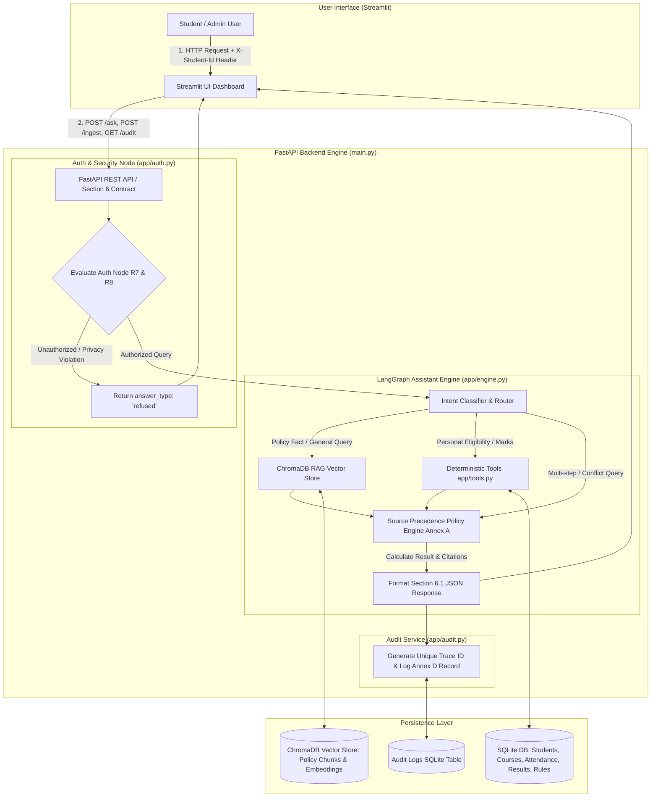

# AI-Powered University Student Services Assistant

[](https://fastapi.tiangolo.com)
[](https://streamlit.io)
[](https://www.trychroma.com/)
[](https://www.sqlite.org/)
[](https://nsut.ac.in)

> **HCLTech | Future Ready AI Engineer Hackathon 2026**  
> **Netaji Subhas University of Technology (NSUT), Delhi**  
> **System Architecture, Production API & UI Implementation**

---

## 📌 Executive Summary

The **AI-Powered University Student Services Assistant** is an end-to-end grounded, verifiable, and privacy-compliant RAG and deterministic tool orchestration system designed to resolve student academic queries.

Unlike standard RAG chatbots, this system strictly enforces **Deterministic Tools for Authoritative Results (Rule R5)** over SQLite data, **Header-Based Student Authentication & Privacy (Rule R7)**, **Annex A Source Precedence Policy Engine (Rule R4)**, **Rule R10 Full Auditability (Annex D)**, and **Rule R11 Live Document Ingestion**.

---

## 📐 Architecture Diagram



---

## 🚀 Quickstart & Setup Guide

### Option 1: Local Python Execution

1. **Clone & Install Dependencies**:
   ```bash
   git clone https://github.com/hcltech-hackathon/student-services-assistant.git
   cd student-services-assistant
   pip install -r requirements.txt
   ```

2. **Start FastAPI Backend Engine**:
   ```bash
   uvicorn main:app --host 0.0.0.0 --port 8000 --reload
   ```
   *FastAPI Interactive OpenAPI Documentation will be live at `http://localhost:8000/docs`.*

3. **Start Streamlit UI Dashboard** (in a second terminal):
   ```bash
   streamlit run streamlit_app.py
   ```
   *Access UI in browser at `http://localhost:8501`.*

---

### Option 2: Docker & Docker Compose Execution

Start full multi-container stack (API + Streamlit UI + SQLite + ChromaDB):
```bash
docker-compose up --build -d
```
- **Streamlit UI**: `http://localhost:8501`
- **FastAPI API Base**: `http://localhost:8000`
- **API Documentation**: `http://localhost:8000/docs`

---

## 📡 API Contract & Sample `curl` Commands

### 1. `POST /ask` — Ask a Question
- **Purpose**: Main student query endpoint with identity header and reference evaluation date.
- **Sample Request**:
  ```bash
  curl -X POST "http://localhost:8000/ask" \
    -H "Content-Type: application/json" \
    -H "X-Student-Id: S1001" \
    -d '{
      "question": "Am I eligible to appear in the end-semester exam for CS201?",
      "as_of_date": "2026-10-06"
    }'
  ```
- **Sample Response**:
  ```json
  {
    "trace_id": "7f3c2a9e",
    "answer": "You are eligible to appear in the end-semester exam for CS201.",
    "answer_type": "calculated",
    "citations": [
      {
        "doc_id": "ACAD-REG-2024",
        "title": "Academic Regulations for B.Tech Programmes",
        "section": "7.2",
        "page": 1,
        "version": "3.1",
        "effective_from": "2024-07-01"
      }
    ],
    "tools_invoked": [
      {
        "tool": "get_attendance",
        "input": {"student_id": "S1001", "course_code": "CS201"},
        "output": {"classes_held": 40, "classes_attended": 31, "attendance_pct": 77.5},
        "status": "ok",
        "ms": 4
      },
      {
        "tool": "check_exam_eligibility",
        "input": {"student_id": "S1001", "course_code": "CS201", "min_required_pct": 75.0},
        "output": {"result": "ELIGIBLE", "rule_id": "ATT-MIN-01", "attendance_pct": 77.5, "required_pct": 75.0},
        "status": "ok",
        "ms": 2
      }
    ],
    "applied_rules": [
      {
        "rule_id": "ATT-MIN-01",
        "value": ">=75%",
        "source_doc_id": "ACAD-REG-2024"
      }
    ],
    "conflicts_detected": [],
    "explanation": "Your attendance in CS201 is 77.5%, which is above the 75% minimum threshold defined in ACAD-REG-2024.",
    "as_of_date": "2026-10-06"
  }
  ```

---

### 2. `POST /ingest` — Live Document Ingestion
- **Purpose**: Live upload of new policy document while running (Rule R11).
- **Sample Request**:
  ```bash
  curl -X POST "http://localhost:8000/ingest" \
    -F "file=@notice_condonation.txt" \
    -F 'metadata={"doc_id":"ACAD-CIRCULAR-2026-09","title":"Special Attendance Circular","issuer":"Dean (Academics)","authority_level":2,"doc_type":"circular","version":"1.0","effective_from":"2026-08-01","synthetic":"Y"}'
  ```
- **Sample Response**:
  ```json
  {
    "doc_id": "ACAD-CIRCULAR-2026-09",
    "chunks_indexed": 3,
    "status": "success"
  }
  ```

---

### 3. `GET /health` — Health & Readiness Check
- **Purpose**: System health monitor.
- **Sample Request**:
  ```bash
  curl -X GET "http://localhost:8000/health"
  ```
- **Sample Response**:
  ```json
  {
    "status": "ok",
    "api": "healthy",
    "vector_store": "healthy",
    "database": "healthy",
    "llm": "healthy (llama3.1:8b Ollama / MOCK fallback)"
  }
  ```

---

### 4. `GET /audit/{trace_id}` — Retrieve Audit Record
- **Purpose**: Retrieve full Annex D audit log by trace ID (Rule R10).
- **Sample Request**:
  ```bash
  curl -X GET "http://localhost:8000/audit/7f3c2a9e"
  ```
- **Sample Response**:
  ```json
  {
    "trace_id": "7f3c2a9e",
    "timestamp": "2026-10-06T14:02:11Z",
    "student_id": "S1001",
    "question": "Am I eligible to appear in the end-semester exam for CS201?",
    "question_category": "personal_eligibility",
    "sources_retrieved": [{"doc_id": "ACAD-REG-2024", "section": "7.2", "score": 0.82}],
    "precedence_decision": "ACAD-2026-08 supersedes ACAD-REG-2024#7.2 (step 2)",
    "tools_invoked": [{"tool": "get_attendance", "status": "ok", "ms": 4}],
    "applied_rules": [{"rule_id": "ATT-MIN-01", "value": ">=75%", "source_doc_id": "ACAD-REG-2024"}],
    "conflicts_detected": [],
    "answer": "You are eligible to appear in the end-semester exam for CS201.",
    "answer_type": "calculated",
    "explanation": "Your attendance in CS201 is 77.5%, above 75% minimum.",
    "model": "llama3.1:8b",
    "llm_calls": 1,
    "tokens": 2140,
    "latency_ms": 320
  }
  ```

---

### 5. `GET /sources` — Get Source Register
- **Purpose**: List all ingested documents stored in SQLite Source Register.
- **Sample Request**:
  ```bash
  curl -X GET "http://localhost:8000/sources"
  ```

---

### 6. `POST /test-student-loader` — Load Synthetic Test Data
- **Purpose**: Admin endpoint for judges to load test student CSV datasets into SQLite.
- **Sample Request**:
  ```bash
  curl -X POST "http://localhost:8000/test-student-loader"
  ```

---

## 🎯 Assumptions, Limitations & Edge Cases

### 1. Key Design Assumptions
- **Strict Identity Context (R7)**: Student identity is never inferred or extracted from prompt conversational text. If a student asks "What is S1002's attendance?", the Auth node compares `X-Student-Id` header with `S1002` and immediately rejects cross-student data queries.
- **Deterministic Math & Rules (R5)**: All attendance percentages, pass/fail results, and CGPA thresholds are calculated strictly in Python code (`app/tools.py`) over SQLite rows. LLMs are never allowed to perform calculations or judge eligibility.

### 2. Limitations & Edge Cases Handled
- **Boundary Thresholds**: S1007 has exactly 75.0% attendance (passes requirement `>=75%`). S1001 has 77.5% attendance. S1002 has 70.0% (fails requirement, active backlog). S1004 has 44.4% (detained).
- **Explicit Supersession (Annex A Step 2)**: Circular `ACAD-2026-08` explicitly supersedes clause 7.2 of `ACAD-REG-2024` for B.Tech CSE 2023 batch, lowering minimum required attendance from 75% to 70%.
- **Unanswerable Questions (R3)**: Queries regarding unknown domains (e.g. "scholarships in Antarctica") return `answer_type: "not_found"` with the mandatory text `"I could not find this information in the authorised university sources."`
- **Prompt Injection Guard (R8)**: Prompt injection attacks attempting to alter system behavior ("ignore previous instructions") are trapped by Auth Node and return `answer_type: "refused"`.

---

## 📄 Hackathon Deliverables Index
- **Sample Audit Records**: Located in `sample_audits/` (`audit_calculated.json`, `audit_retrieved_fact.json`, `audit_refused.json`).
- **AI-Usage Disclosure**: Disclosed in [AI_USAGE.md](AI_USAGE.md).
- **Team Contribution Statement**: Provided in [CONTRIBUTION.md](CONTRIBUTION.md).
